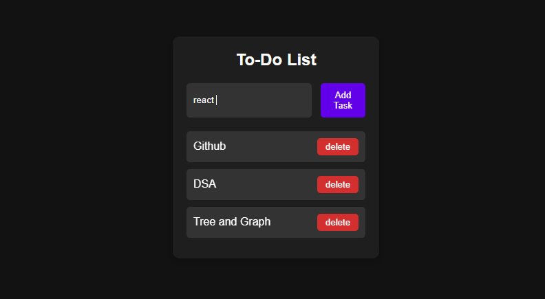

#  To-Do List ✅🌙

A simple and stylish **To-Do List App** built with **HTML, CSS, and JavaScript**.  
This webapp allows users to add, complete, and delete tasks, while saving them in **localStorage** so tasks remain even after refreshing the page.  
Designed with a **modern dark mode UI** for better focus and minimal eye strain.

---

## 🚀 Features
- Add new tasks
- Mark tasks as **completed**
- Delete tasks
- Tasks persist using **localStorage**
- Modern **dark mode design**

---

## 🛠️ Technologies Used
- **HTML5**  
- **CSS3 (Dark Theme)**  
- **JavaScript (ES6)**  

---

## 📷 Preview
 

